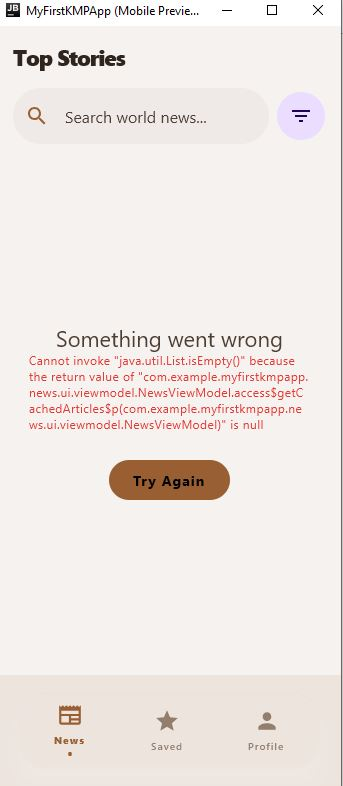

# My Profile & News App - Pemob_6 (KMP Edition)

[](https://kotlinlang.org/)
[](https://www.jetbrains.com/lp/compose-multiplatform/)
[](https://developer.android.com/topic/architecture)

**My Profile & News App** merupakan aplikasi Multiplatform berbasis Kotlin yang mengimplementasikan arsitektur MVVM (Model-View-ViewModel) dan Repository Pattern. Project ini menggabungkan manajemen profil skeuomorphic dengan sistem pembaca berita modern.

---

## News Reader (WEEK_6) - FINAL

Tugas Praktikum Minggu 6 berfokus pada melengkapi fitur integrasi data API dan membangun tampilan sistem pembaca berita modern layaknya aplikasi sosial media masa kini.

Fitur pembaca berita ini sudah memenuhi kriteria Tugas Praktikum Minggu 6:
*   **Networking:** Integrasi **Ktor Client** dengan penanganan state asinkron.
*   **Architecture:** Implementasi **Repository Pattern** yang memisahkan logika data dan UI.
*   **Data Parsing:** Pemrosesan JSON otomatis menggunakan **Kotlinx Serialization**.
*   **UI States:** Penanganan lengkap untuk state **Loading** (Shimmer), **Success**, dan **Error** (Retry button).
*   **Image Loading:** Menggunakan **Coil 3** untuk rendering gambar artikel secara dinamis.
*   **Features:**
    *   **TikTok-style Infinite Scroll:** Otomatis menambah deretan berita saat user scroll ke bagian bawah layar tanpa jeda.
    *   **Instant Pull-to-Refresh:** Fungsi usap ke atas yang secara sekejap mengacak posisi *feed* berita di layar tanpa delay loading yang mengganggu.
    *   **Search & Category Filter** (World, Business, Tech, Lifestyle, dll).
    *   **Detail Screen** dengan kemampuan untuk membaca artikel asli langsung via browser eksternal.
    *   **Favorites (Saved Content):** Simpan berita penting untuk dibaca lagi nanti.
*   **API Sources:** 
    *   Utama: [ok.surf API](https://ok.surf/api/v1/cors/news-feed)

---

## Video Demo News Reader (WEEK_6)

Berikut adalah video pendek navigasi untuk membuktikan fungsionalitas Infinite Scroll, Kategori, dan kelancaran Refresh-nya:

https://github.com/Febvn/pemob_6/raw/week-6/Demo%20mews.mp4

*(Jika player GitHub tidak memuat, Anda dapat mengeklik link di atas untuk mengunduhnya).*

### Screenshot Gallery (WEEK_6 News Platform)

| News Landing Page | Article Detail |
| :---: | :---: |
|  |  |

| Saved Content (Favs) | Error/Loading State |
| :---: | :---: |
|  |  |

---

## Previous Features (WEEK_4 & 5)

*   **Integrated Note-Taking System:** Fitur manajemen catatan (Add, Edit, Delete, Favorite) berbasis teks yang efisien.
*   **Professional MVVM Architecture:** Pemisahan tegas antara UI, ViewModel, dan Data.
*   **Dark Monochrome Design:** Estetika skeuomorphic yang elegan dengan palet warna monokrom.
*   **Optimized Performance:** Kecepatan build maksimal dengan manajemen memori 2GB.

---

## Video Demo Navigasi Dasar (WEEK_5)


---

## Screenshot Gallery (Aplikasi Pemob_4)

Berikut adalah galeri tampilan profil dan manajemen catatan:

### Galeri 1: Navigasi & Utama
| Profile View | Note List (Empty) | Note Detail |
| :---: | :---: | :---: |
|  |  |  |

### Galeri 2: Fitur & Modifikasi
| Add Note Form | Note List View | Edit Profile |
| :---: | :---: | :---: |
|  |  |  |

---

## Struktur Proyek

Navigasi paket aplikasi mengikuti standar MVVM yang modular:

```text
├── composeApp/
│   ├── src/commonMain/kotlin/com/example/myfirstkmpapp/
│   │   ├── data/           # Layer Data (Profile)
│   │   ├── news/           # Fitur News Reader (WEEK 6)
│   │   ├── viewmodel/      # Layer Logika
│   │   ├── ui/             # Layer Presentasi
│   │   └── App.kt          # Main Entry Point
```

---

## Instalasi & Cara Menjalankan

Langkah-langkah menjalankan aplikasi pada platform Desktop (JVM):

1. **Clone & Setup:**
   ```powershell
   git clone https://github.com/Febvn/pemob_6.git
   cd pemob_6
   ```
2. **Run Perintah Berikut:**
   ```powershell
   ./gradlew :composeApp:run
   ```

---

## Author (WEEK_6 Solution)

**Febrian Valentino Nugroho**
*   **GitHub:** [@Febvn](https://github.com/Febvn)
*   **Branch Repo:** [github.com/Febvn/pemob_6/tree/week-6](https://github.com/Febvn/pemob_6/tree/week-6)
*   **Kelas:** Pemrograman Mobile (Pemob)

---

## Lisensi

Proyek ini dilisensikan di bawah **MIT License**.
