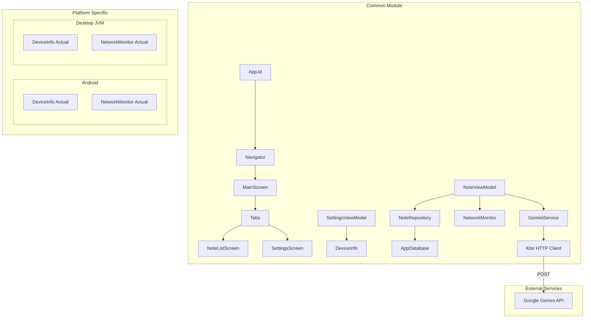

# Notes App - Tugas Praktikum Minggu 09

Aplikasi Catatan Pintar (Notes App) yang dikembangkan menggunakan **Kotlin Multiplatform (KMP)** dan **Compose Multiplatform**. Versi ini memperkenalkan fitur kecerdasan buatan (AI) terintegrasi menggunakan **Gemini API** untuk membantu produktivitas pengguna.

## Fitur Unggulan (Minggu 09: Smart AI Integration)

Fokus utama pada praktikum ini adalah integrasi **AI Note Maker** yang memungkinkan interaksi cerdas antara pengguna dan catatan mereka.

### 1. Smart AI Assistant (Gemini API)
- **Note Generator**: Jika pengguna bingung ingin menulis apa, AI akan memberikan ide kreatif untuk catatan baru.
- **Note Improvement**: Memperbaiki tata bahasa, memperluas poin-poin ide, dan mengubah nada tulisan menjadi lebih profesional secara otomatis.
- **Contextual Understanding**: Menggunakan *System Instruction* untuk memastikan respon AI tetap relevan dengan konteks aplikasi catatan.

### 2. Fitur Pendukung AI
- **Translation Feature**: Menerjemahkan isi catatan ke berbagai bahasa (Default: Inggris) dengan mempertahankan makna asli.
- **Loading State Indicator**: UI yang responsif dengan indikator progres saat AI sedang memproses permintaan.
- **Error Handling**: Penanganan error jaringan atau API menggunakan Snackbar untuk memberikan feedback yang jelas kepada pengguna.

## Dokumentasi Visual (Praktikum 09)

| AI Prompt Interface | AI Generation Result |
|:---:|:---:|
|  |  |

> **Keterangan**: Gambar di atas menunjukkan proses penggunaan AI Assistant untuk menghasilkan ide catatan secara otomatis dari layar "Add Note".

## Fitur Platform & Arsitektur (Minggu 08)

Selain fitur AI, aplikasi ini tetap mempertahankan fondasi kokoh dari praktikum sebelumnya:
- **Koin Dependency Injection**: Manajemen dependensi yang bersih untuk Database, Repository, dan Service.
- **Device Information**: Menampilkan detail perangkat (Model, OS, Platform) secara dinamis di layar Settings.
- **Network Monitoring**: Indikator status jaringan real-time dengan informasi **Ping/Latency**.
- **Platform Features**: Fitur Share catatan menggunakan *Native Sharing* di Android dan iOS.

## Architecture Diagram

## Tech Stack
- **Language**: Kotlin
- **UI Framework**: Compose Multiplatform
- **DI Framework**: Koin
- **Networking**: Ktor Client
- **Local DB**: SQLDelight
- **AI Engine**: Google Gemini API (Generative AI)

## Cara Menjalankan Project
1. Clone repository ini.
2. Buka di Android Studio atau IntelliJ IDEA.
3. Pastikan `JAVA_HOME` mengarah ke JDK 17 atau versi yang kompatibel (misalnya JetBrains Runtime).
4. Jalankan perintah Gradle:
   - **Desktop**: `./gradlew :composeApp:run`
   - **Android**: `./gradlew :composeApp:installDebug`

---
**Pengembangan Aplikasi Mobile - ITERA 2024**  
**Repository:** [Febvn/pemob_9](https://github.com/Febvn/pemob_9)
