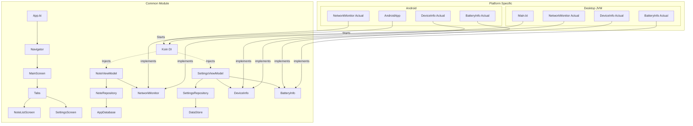
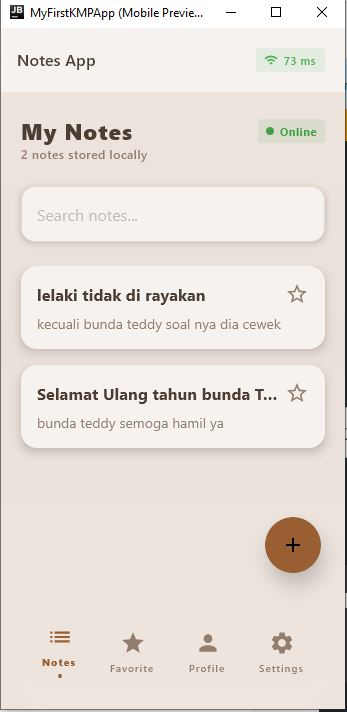

# Notes App - Tugas Praktikum Minggu 8

Upgrade Notes App dengan Platform Features: Koin Dependency Injection, Device Information, dan Network Monitoring menggunakan pola expect/actual.

## Fitur Baru (Week 8)
- **Koin Dependency Injection**: Seluruh dependensi (Database, Repository, ViewModel, Platform Utils) dikelola menggunakan Koin DI secara menyeluruh.
- **Device Information (Expect/Actual)**: Menampilkan detail perangkat (Model, Manufacturer, OS Version, Platform) di layar Settings secara dinamis.
- **Network Monitoring (Expect/Actual)**: Indikator status jaringan (Online/Offline) dan **Real-time Latency (Ping)** di layar utama.
- **Battery Status**: Menampilkan level baterai dan status pengisian daya di layar Settings.
- **Share Note (Platform Feature)**: Membagikan konten catatan menggunakan fitur share sistem.

## Architecture Diagram

## Dokumentasi Visual (Praktikum 8)

### Screenshots
| Network Status Indicator | Device Information (Settings) |
|:---:|:---:|
|  |  |

### Video Demo
Tonton video demo fitur platform (Dependency Injection, Network Status, & Device Info) di sini:
[Demo Network & Platform Features](demo_network.mp4)

## Tech Stack
- **Kotlin Multiplatform (KMP)**
- **Compose Multiplatform**
- **Koin DI**: Dependency Injection core, android, and compose.
- **SQLDelight**: Local Database.
- **Jetpack DataStore**: Persistent Settings.
- **Voyager**: Navigation with Koin integration.

---
**Pengembangan Aplikasi Mobile - ITERA 2024**  
**Repository:** [Febvn/pemob_8](https://github.com/Febvn/pemob_8) (Branch: week-8)
